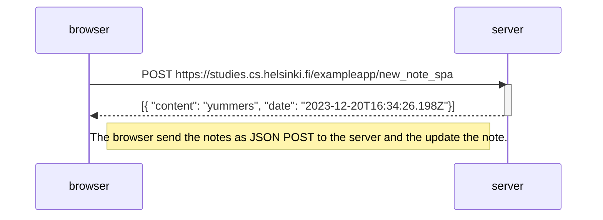

```mermaid
sequenceDiagram
    participant browser
    participant server

    browser->>server: POST https://studies.cs.helsinki.fi/exampleapp/new_note_spa
    activate server
    server-->>browser: [{ "content": "yummers", "date": "2023-12-20T16:34:26.198Z"}]
    deactivate server

    Note right of browser: The browser send the notes as JSON POST to the server and the update the note.
```
